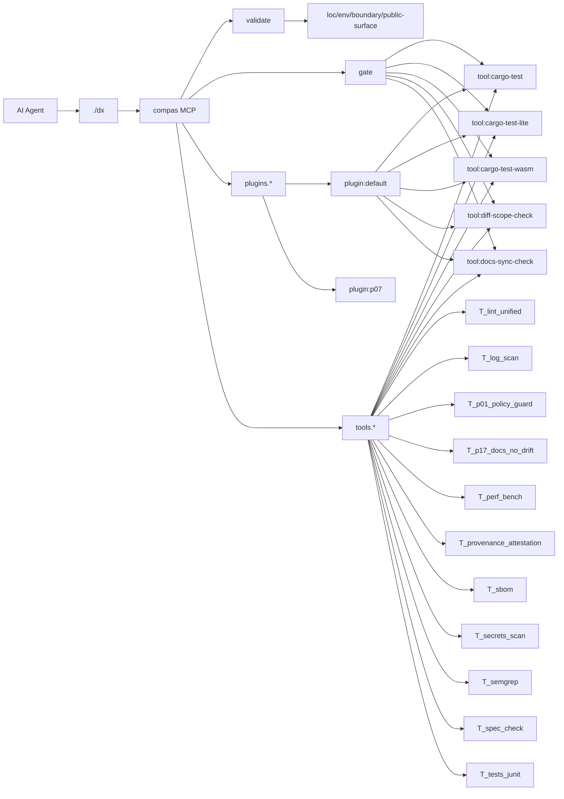

# AGENTS

## Rules (max 10 lines)
1) `cargo test -p ai-dx-mcp` обязателен перед любым финалом.
2) `cargo run -p ai-dx-mcp -- validate ratchet` обязателен после правок.
3) `./dx ci-fast --dry-run` обязателен как итоговый локальный гейт.
4) Любой новый инструмент добавляется только через `tool.toml`.
5) Любой новый плагин добавляется только через `plugin.toml`.
6) Описания plugin/tool обязательны и должны быть короткими и ясными.
7) Любая ошибка конфигурации считается блокирующей (fail-closed).
8) Архитектуру правим через `./dx docs-sync`, не вручную в auto-блоках.
9) Изменения делаем малыми и доводим до зелёного Verify.
10) Истина в коде и автосинке; compas держим lean: минимум инструментов/команд/семантики при максимальном покрытии задач AI‑разработки; расширяемость плагинами и подключение существующих инструментов должны быть простыми (не “полоса препятствий”, не 101 инструмент и 999 вызовов ради 1 действия).

## Architecture quick map
Ниже auto-managed карта, синхронизация: `./dx docs-sync`.

<!-- COMPAS_AUTO_ARCH:BEGIN -->
_fingerprint: 63c5720d74772e3c_

## Runtime Map (auto)

### Core paths
| Segment | Path |
|---|---|
| MCP server | `crates/ai-dx-mcp/src/server.rs` |
| Runtime pipeline | `crates/ai-dx-mcp/src/{app,repo,runner}.rs` |
| Plugin configs | `.agents/mcp/compas/plugins/*/plugin.toml` |
| Tool manifests | `tools/custom/**/tool.toml` |
| Docs sync script | `scripts/docs_sync.py` |
| DX wrapper | `dx` |

### Installed plugins
| Plugin | Purpose | Tools | Gates (ci-fast / ci / flagship) |
|---|---|---|---|
| `default` | MVP config for developing compas MCP in this repo | `cargo-test`, `cargo-test-lite`, `cargo-test-wasm`, `docs-sync-check` | `docs-sync-check`, `cargo-test`, `cargo-test-lite` / `docs-sync-check`, `cargo-test`, `cargo-test-lite` / `docs-sync-check`, `cargo-test`, `cargo-test-lite`, `cargo-test-wasm` |
| `p07` | Dead code and orphan API detection | — | — / — / — |

### Installed tools
| Tool | Owner plugin | Purpose | Command |
|---|---|---|---|
| `cargo-test` | `default` | Run cargo test (workspace) | `cargo` |
| `cargo-test-lite` | `default` | Cargo test (ai-dx-mcp, --no-default-features) | `cargo` |
| `cargo-test-wasm` | `default` | Cargo test (ai-dx-mcp, wasm feature on lite profile) | `cargo` |
| `diff-scope-check` | `default` | Check changed files against the explicit scope contract for plugin P03 | `python3` |
| `docs-sync-check` | `default` | Verify that architecture docs and diagrams are in sync | `python3` |
| `lint-unified` | `default` | Run unified lint checks (clippy first, then language linters when relevant) through one gate tool | `python3` |
| `log-scan` | `default` | Scan code and config files for potential PII or secret leakage through logging calls | `python3` |
| `p01-policy-guard` | `p01` | Validate plugin tool commands do not use shell binaries in strict mode | `python3` |
| `p17-docs-no-drift` | `p17` | Run docs sync no-drift validation across managed docs and supported generators | `python3` |
| `perf-bench` | `p20` | Compare performance baselines against current metrics and fail on budget regressions | `python3` |
| `provenance-attestation` | `default` | Run provenance/attestation evidence check for release artifact supply-chain integrity. | `python3` |
| `sbom` | `default` | Generate and validate lightweight SBOM metadata for dependency manifests | `python3` |
| `secrets-scan` | `default` | Run secrets leakage scan using semgrep, gitleaks, and trufflehog | `python3` |
| `semgrep` | `default` | Run semgrep SARIF scan for security baseline findings | `semgrep` |
| `spec-check` | `default` | Validate Spec/ADR gate artifacts (Goal, Non-goals, Acceptance, Edge-cases, Rollback) before code | `python3` |
| `tests-junit` | `default` | Run normalized JUnit-aware test checks for Rust and Python suites | `python3` |

### MCP surface
`compas.catalog`, `compas.exec`, `compas.gate`, `compas.init`, `compas.validate`

### Mermaid

<!-- COMPAS_AUTO_ARCH:END -->
