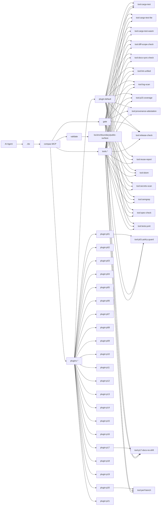

# ARCHITECTURE

SSOT архитектуры проекта `compas`.
Источник данных для карты: `scripts/docs_sync.py`.

<!-- COMPAS_AUTO_ARCH:BEGIN -->
_fingerprint: 1e8325672ac9ae85_

## Runtime Map (auto)

### Core paths
| Segment | Path |
|---|---|
| MCP server | `crates/ai-dx-mcp/src/server.rs` |
| Runtime pipeline | `crates/ai-dx-mcp/src/{app,repo,runner}.rs` |
| Plugin configs | `.agents/mcp/compas/plugins/*/plugin.toml` |
| Tool manifests | `tools/custom/**/tool.toml` |
| Docs sync script | `scripts/docs_sync.py` |
| DX wrapper | `dx` |

### Installed plugins
| Plugin | Purpose | Tools | Gates (ci-fast / ci / flagship) |
|---|---|---|---|
| `default` | MVP config for developing compas MCP in this repo | `cargo-test`, `cargo-test-lite`, `cargo-test-wasm`, `diff-scope-check`, `docs-sync-check`, `lint-unified`, `log-scan`, `p15-coverage`, `provenance-attestation`, `release-check`, `reuse-report`, `sbom`, `secrets-scan`, `semgrep`, `spec-check`, `tests-junit` | `docs-sync-check`, `cargo-test` / `docs-sync-check`, `cargo-test`, `cargo-test-lite` / `docs-sync-check`, `cargo-test`, `cargo-test-lite`, `cargo-test-wasm` |
| `p01` | Paranoid Tool Policy guardrail for strict tool execution | `p01-policy-guard` | `p01-policy-guard`, `cargo-test-lite` / `p01-policy-guard` / `p01-policy-guard` |
| `p02` | Spec/ADR gate plugin: enforce goal, non-goals, acceptance, edge-cases and rollback before implementation | — | `spec-check` / `spec-check` / `spec-check` |
| `p03` | P03 plugin enforces plan-to-diff scope consistency checks | — | `diff-scope-check` / `diff-scope-check` / `diff-scope-check` |
| `p04` | Architecture layers, contract boundaries, and boundary policy hardening | — | — / — / — |
| `p05` | P05 gate extension with reuse-report tool | — | `reuse-report` / `reuse-report` / `reuse-report` |
| `p06` | Complexity and LOC budgets for ai-dx-mcp changes | — | — / — / — |
| `p07` | Dead code and orphan API detection | — | — / — / — |
| `p08` | P08 staged integration: reserve plugin slot without changing active checks hash | — | — / — / `docs-sync-check` |
| `p09` | Supply-chain gate for deterministic dependency lockfiles and stable versions | — | — / — / — |
| `p10` | SBOM gate plugin for dependency manifests and lockfile traceability | — | `sbom` / `sbom` / `sbom` |
| `p11` | Provenance and attestation gate for release artifact integrity and trust. | — | `provenance-attestation` / `provenance-attestation` / `provenance-attestation` |
| `p12` | P12 wiring: add Semgrep security scan into gate flow | — | `semgrep` / `semgrep` / `semgrep` |
| `p13` | Secrets Leakage Guard plugin for blocking secret exposure checks. | — | `secrets-scan` / — / — |
| `p14` | P14 enforces normalized JUnit-aware test execution in gate | — | `tests-junit` / `tests-junit` / `tests-junit` |
| `p15` | Coverage non-regression guard for quality posture | — | `p15-coverage` / `p15-coverage` / `p15-coverage` |
| `p16` | P16 impact-to-gate wiring for runtime Rust changes | — | `cargo-test-wasm` / — / — |
| `p17` | Docs sync no-drift checks for architecture and documentation contract health | `p17-docs-no-drift` | `p17-docs-no-drift` / — / — |
| `p18` | Prevent PII and secret leaks in logging output | — | `log-scan` / `log-scan` / `log-scan` |
| `p19` | P19 plugin wires a unified lint gate for rust, python, and js/ts quality checks | — | `lint-unified` / `lint-unified` / `lint-unified` |
| `p20` | Performance Regression Budget gate for AI edits and runtime-impact checks. | `perf-bench` | `perf-bench` / `perf-bench` / `perf-bench` |
| `p21` | CI/CD release-readiness enforcement for deterministic publishing | — | `release-check` / `release-check` / `release-check` |

### Installed tools
| Tool | Owner plugin | Purpose | Command |
|---|---|---|---|
| `cargo-test` | `default` | Run cargo test (workspace) | `cargo` |
| `cargo-test-lite` | `default` | Cargo test (ai-dx-mcp, --no-default-features) | `cargo` |
| `cargo-test-wasm` | `default` | Cargo test (ai-dx-mcp, wasm feature on lite profile) | `cargo` |
| `diff-scope-check` | `default` | Check changed files against the explicit scope contract for plugin P03 | `python3` |
| `docs-sync-check` | `default` | Verify that architecture docs and diagrams are in sync | `python3` |
| `lint-unified` | `default` | Run unified lint checks (clippy first, then language linters when relevant) through one gate tool | `python3` |
| `log-scan` | `default` | Scan code and config files for potential PII or secret leakage through logging calls | `python3` |
| `p01-policy-guard` | `p01` | Validate plugin tool commands do not use shell binaries in strict mode | `python3` |
| `p15-coverage` | `default` | Coverage non-regression check against previous quality baseline | `python3` |
| `p17-docs-no-drift` | `p17` | Run docs sync no-drift validation across managed docs and supported generators | `python3` |
| `perf-bench` | `p20` | Compare performance baselines against current metrics and fail on budget regressions | `python3` |
| `provenance-attestation` | `default` | Run provenance/attestation evidence check for release artifact supply-chain integrity. | `python3` |
| `release-check` | `default` | Run release readiness checks for CI/CD stability and publish safety | `python3` |
| `reuse-report` | `default` | Emit a compact JSON report for P05 rollout/hardening checks | `python3` |
| `sbom` | `default` | Generate and validate lightweight SBOM metadata for dependency manifests | `python3` |
| `secrets-scan` | `default` | Run secrets leakage scan using semgrep, gitleaks, and trufflehog | `python3` |
| `semgrep` | `default` | Run semgrep SARIF scan for security baseline findings | `semgrep` |
| `spec-check` | `default` | Validate Spec/ADR gate artifacts (Goal, Non-goals, Acceptance, Edge-cases, Rollback) before code | `python3` |
| `tests-junit` | `default` | Run normalized JUnit-aware test checks for Rust and Python suites | `python3` |

### MCP surface
`compas.catalog`, `compas.exec`, `compas.gate`, `compas.init`, `compas.validate`

### Mermaid

<!-- COMPAS_AUTO_ARCH:END -->
