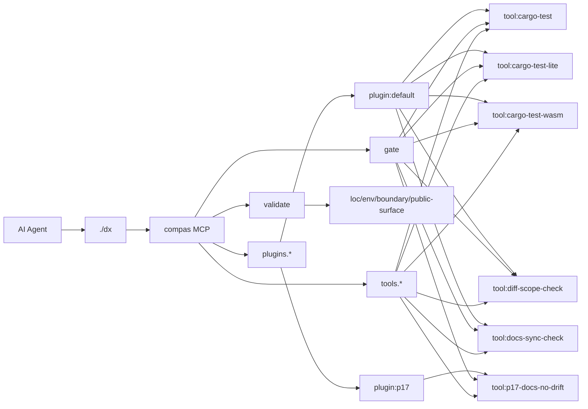

# ARCHITECTURE

SSOT архитектуры проекта `compas`.
Источник данных для карты: `scripts/docs_sync.py`.

<!-- COMPAS_AUTO_ARCH:BEGIN -->
_fingerprint: ee31cecc77836f1a_

## Runtime Map (auto)

### Core paths
| Segment | Path |
|---|---|
| MCP server | `crates/ai-dx-mcp/src/server.rs` |
| Runtime pipeline | `crates/ai-dx-mcp/src/{app,repo,runner}.rs` |
| Plugin configs | `.agents/mcp/compas/plugins/*/plugin.toml` |
| Tool manifests | `tools/custom/**/tool.toml` |
| Docs sync script | `scripts/docs_sync.py` |
| DX wrapper | `dx` |

### Installed plugins
| Plugin | Purpose | Tools | Gates (ci-fast / ci / flagship) |
|---|---|---|---|
| `default` | MVP config for developing compas MCP in this repo | `cargo-test`, `cargo-test-lite`, `cargo-test-wasm`, `docs-sync-check` | `docs-sync-check`, `cargo-test` / `docs-sync-check`, `cargo-test`, `cargo-test-lite` / `docs-sync-check`, `cargo-test`, `cargo-test-lite`, `cargo-test-wasm` |
| `p17` | Docs sync no-drift checks for architecture and documentation contract health | `p17-docs-no-drift` | `p17-docs-no-drift` / — / — |

### Installed tools
| Tool | Owner plugin | Purpose | Command |
|---|---|---|---|
| `cargo-test` | `default` | Run cargo test (workspace) | `cargo` |
| `cargo-test-lite` | `default` | Cargo test (ai-dx-mcp, --no-default-features) | `cargo` |
| `cargo-test-wasm` | `default` | Cargo test (ai-dx-mcp, wasm feature on lite profile) | `cargo` |
| `diff-scope-check` | `default` | Check changed files against the explicit scope contract for plugin P03 | `python3` |
| `docs-sync-check` | `default` | Verify that architecture docs and diagrams are in sync | `python3` |
| `p17-docs-no-drift` | `p17` | Run docs sync no-drift validation across managed docs and supported generators | `python3` |

### MCP surface
`compas.catalog`, `compas.exec`, `compas.gate`, `compas.init`, `compas.validate`

### Mermaid

<!-- COMPAS_AUTO_ARCH:END -->
